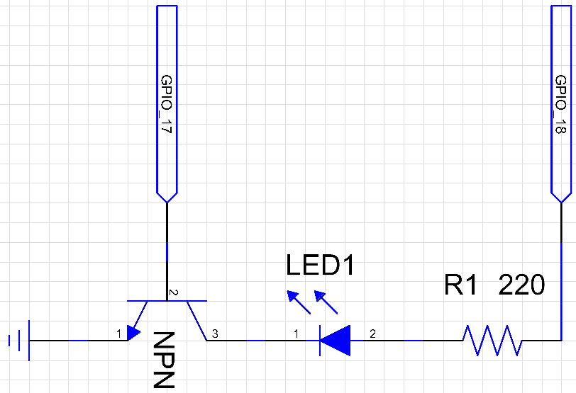
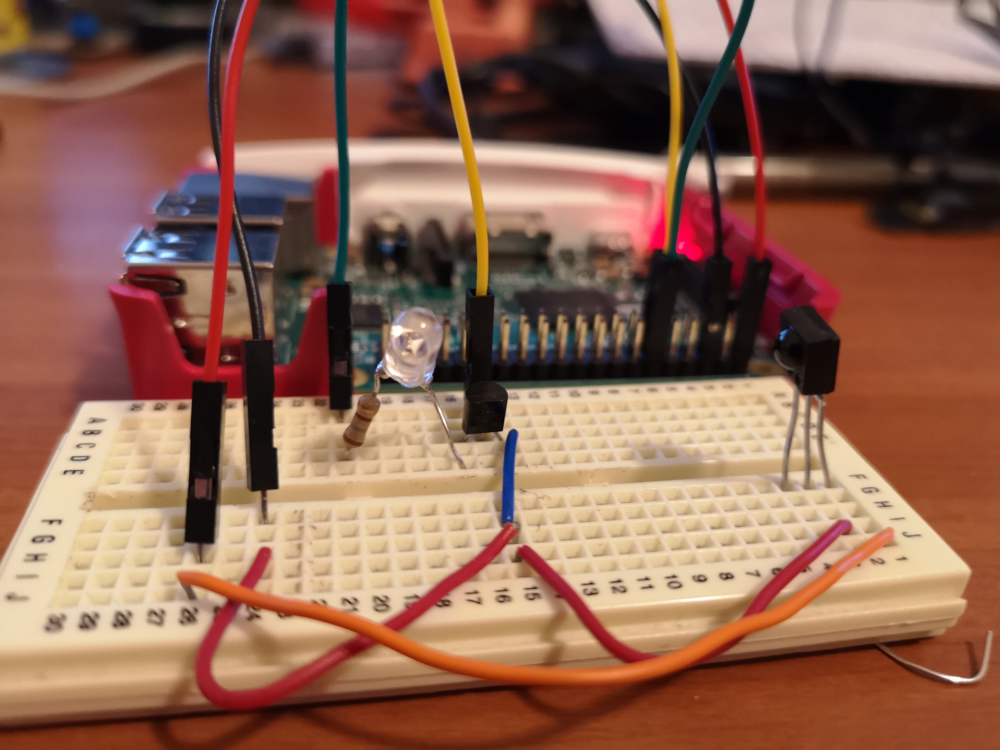
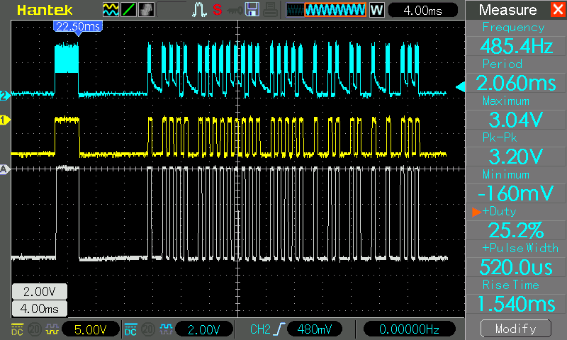
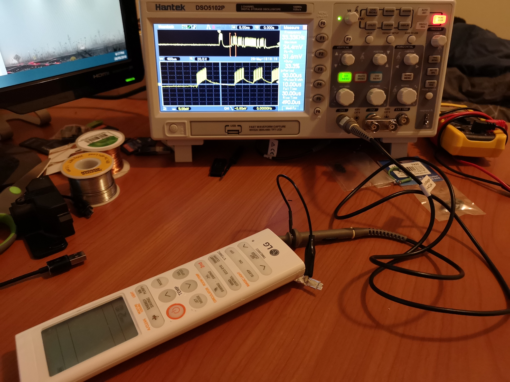

# Raspberry Pi Infrared (IR) Remote

This is a simple IR remote based on a Raspberry Pi 3. It uses pre-calculated remote control codes to control a device and a web interface to send the ON / OFF signals. 
 
This project is still under active development. 
Currently the script only sends the code to turn an LG inverter heater ON in heating mode at 16 degrees celcuis. There are some other details in the signal but I haven't fully decoded it yet. 
TODO: Add a web interface 
TODO: Decode signal and CRC checksum 
TODO: Full functioning web-based remote control 
TODO: Figure out how to make **pigpio** stop using CPU when not in use. 

## Circuit

An IR remote uses binary data to modulate a 38 KHz carrier wave so that for a binary 1 means sending a 38 KHz square wave, and a binary 0 means sending nothing. I could not get the Raspberry Pi, 
or any of the PWM libraries that I tested to reliably start/stop the PWM output fast enough to make the 500 microsecond (us) bit width required for this signal.
The current implemtation uses a constant PWM output on ***GPIO pin 18*** to the ***collector*** of a NPN type transistor which is then modulated on/off by the data stream on ***GPIO pin 17***. 
 
Circuit diagram of the two outputs, transistor, and LED. 
 
The components hooked up on a breadboard. 
 
The black component on the far right is the IR reciver used for testing which appears as the yellow waveform on the oscilloscope output. The blue wave is the signal at the emitter of the transistor, 
and the grey reference signal is the output of the actual remote. 

## Installation

So far the single Python script only requires *pigpio* which should be included the **Raspbian Jessie** release, but otherwise can be download from http://abyz.me.uk/rpi/pigpio/download.html .
You will need to run **sudo pigpio** once before the script will work, or set it to run at boot time ( https://www.raspberrypi.org/forums/viewtopic.php?t=103752 ). 
Simply running the script with **python IRTX.py** will start the carrier wave on GPIO 18, and send the desired signal on GPIO 17. 

## Modification

To make this work for your own remote controlled devices you will need to record the code that each operation uses, or decode the functions manually. I did this using an IR receiving chip 
through an oscilloscope and manually counted the bits (grey waveform above). If you do not have an IR receiver you should be able to see the output signal by measuring voltage drop across 
the batteries of the remote. 
 
 
While all remote controlls seem to use a 38 KHz carrier wave, you will need to know a few specifics about the waveform you are relicating. For this case they are; 
* Preamble: 3200 us HIGH pulse + 9600 us LOW
* Pulse width (each bit): 500 us HIGH + 500 us LOW
